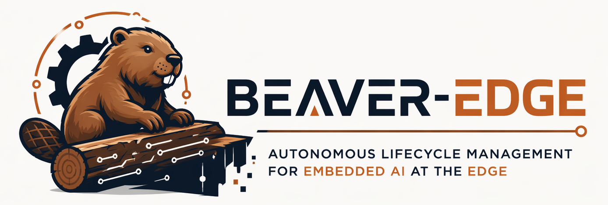
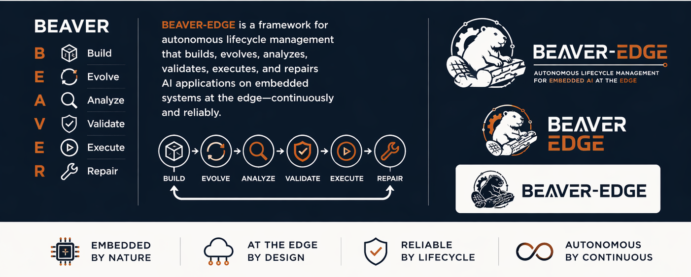

> Source code is [here](https://github.com/beaver-edge/beaver-edge).
> Dataset for results reproduction from the paper published at Middleware26 is available [here](https://github.com/beaver-edge/middleware26).
## 🦫 What is BEAVER?

BEAVER is a framework for autonomous lifecycle management of embedded AI systems.

It automates the end-to-end development pipeline, from data processing and model transformation to deployment and execution, across heterogeneous devices, ranging from highly constrained microcontrollers to more capable edge platforms.

At its core, BEAVER leverages Large Language Models (LLMs) as an orchestration layer, combining:
- device-aware context construction  
- structured interaction with toolchains  
- iterative validation and error-driven refinement  

Rather than generating one-shot solutions, BEAVER operates as a closed-loop system, where artifacts are continuously generated, validated, and improved until they meet the constraints of the target device.

This makes it possible to:
- reduce the need for deep cross-domain expertise  
- enable partial or fully offline development workflows  
- support a wide spectrum of embedded and edge AI deployments  

In short, BEAVER turns fragmented, manual workflows into a self-refining and adaptive lifecycle process for embedded AI.

(Or, if you prefer: it builds, tests, and fixes things — just like a beaver would.)

## 🦫 Why BEAVER?

**Because… it just fits.**

Beavers are nature's original systems engineers. They build, monitor, repair, and adapt continuously. They turn messy environments into stable, functioning ecosystems. Sounds familiar?

That’s exactly what **BEAVER** does for embedded AI systems:

- **Build** artifacts  
- **Evolve** them over time  
- **Analyze** behavior  
- **Validate** correctness  
- **Execute** on-device  
- **Repair** when things break  

In other words, *autonomous lifecycle management*. The way it should be.

Also, let’s be honest: we just really like beavers 🦫  

They’re hardworking, resilient, and quietly brilliant. If our system can be half as reliable as a beaver maintaining a dam, we’re doing something right.

---

**Autopilots need parachutes. Beavers already know that.**

<!-- 

 -->
